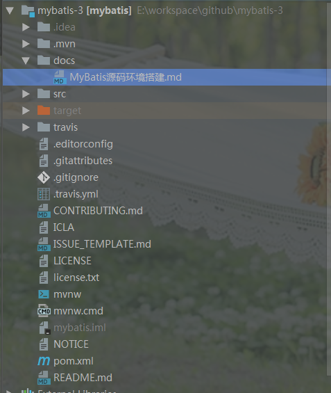
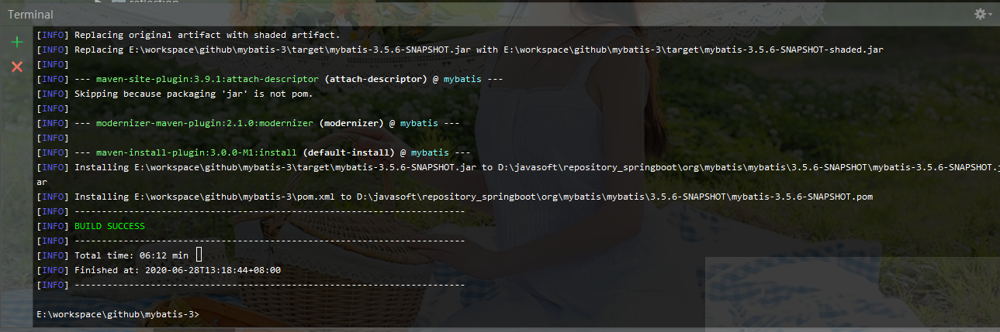

# MyBatis源码环境搭建

## 项目下载

> https://github.com/mybatis/mybatis-3




# 项目构建

​		Mybatis源码很简单，就一个普通的maven项目。但要注意，刚下载下来时，项目无法正常的导入jar包。因为找不到对应的parent相关配置。Mybatis的parent maven项目是一独立，因此我们需要单独的下载parent项目，然后导入到Maven中。

## Parent项目下载

> https://github.com/mybatis/parent

执行`mvn clean install`命令，安装Parent的项目

```lua
E:\workspace\github\parent>mvn clean install
[INFO] Scanning for projects...
[INFO]
[INFO] ---------------------< org.mybatis:mybatis-parent >---------------------
[INFO] Building mybatis-parent 32-SNAPSHOT
[INFO] --------------------------------[ pom ]---------------------------------
[INFO]
[INFO] --- maven-clean-plugin:3.1.0:clean (default-clean) @ mybatis-parent ---
[INFO] Deleting E:\workspace\github\parent\target
[INFO]
[INFO] --- maven-enforcer-plugin:3.0.0-M1:enforce (enforce-java) @ mybatis-parent ---
[INFO]
[INFO] --- jacoco-maven-plugin:0.8.5:prepare-agent (prepare-agent) @ mybatis-parent ---
[INFO] argLine set to -javaagent:D:\\javasoft\\repository_springboot\\org\\jacoco\\org.jacoco.agent\\0.8.5\\org.jacoco.agent-0.8.5-runtime.jar=destfile=E:\\workspace\\github\\par
ent\\target\\jacoco.exec
[INFO]
[INFO] --- whitespace-maven-plugin:1.0.4:trim (default) @ mybatis-parent ---
[INFO]
[INFO] --- license-maven-plugin:3.0:format (default) @ mybatis-parent ---
[INFO] Updating license headers...
[INFO]
[INFO] --- animal-sniffer-maven-plugin:1.18:check (check-java-compat) @ mybatis-parent ---
[INFO] Checking unresolved references to org.codehaus.mojo.signature:java18:1.0
[INFO]
[INFO] --- maven-bundle-plugin:4.2.1:manifest (bundle-manifest) @ mybatis-parent ---
[WARNING] Ignoring project type pom - supportedProjectTypes = [jar, bundle, war, maven-plugin]
[INFO]
[INFO] --- maven-site-plugin:3.9.1:attach-descriptor (attach-descriptor) @ mybatis-parent ---
[INFO] Attaching 'src\site\site.xml' site descriptor with classifier 'site'.
[INFO]
[INFO] --- modernizer-maven-plugin:2.1.0:modernizer (modernizer) @ mybatis-parent ---
[INFO]
[INFO] --- maven-install-plugin:3.0.0-M1:install (default-install) @ mybatis-parent ---
[INFO] Installing E:\workspace\github\parent\pom.xml to D:\javasoft\repository_springboot\org\mybatis\mybatis-parent\32-SNAPSHOT\mybatis-parent-32-SNAPSHOT.pom
[INFO] Installing E:\workspace\github\parent\target\mybatis-parent-32-SNAPSHOT-site.xml to D:\javasoft\repository_springboot\org\mybatis\mybatis-parent\32-SNAPSHOT\mybatis-parent
-32-SNAPSHOT-site.xml
[INFO] ------------------------------------------------------------------------
[INFO] BUILD SUCCESS
[INFO] ------------------------------------------------------------------------
[INFO] Total time: 22.368 s
[INFO] Finished at: 2020-06-28T13:09:08+08:00
[INFO] ------------------------------------------------------------------------
l
```

> BUILD SUCCESS 表明构建成功.

## 项目导入 

如果没有安装parent项目,是无法正常导入 导入 maven依赖的。安装好parent项目后，reimport maven，即可以正常导入jar包依赖。


## 编译项目

执行命令`mvn clean install`，可以正常的编译项目：

